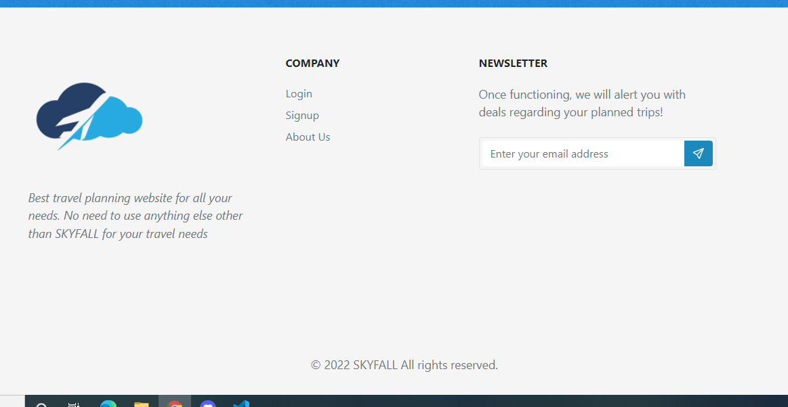
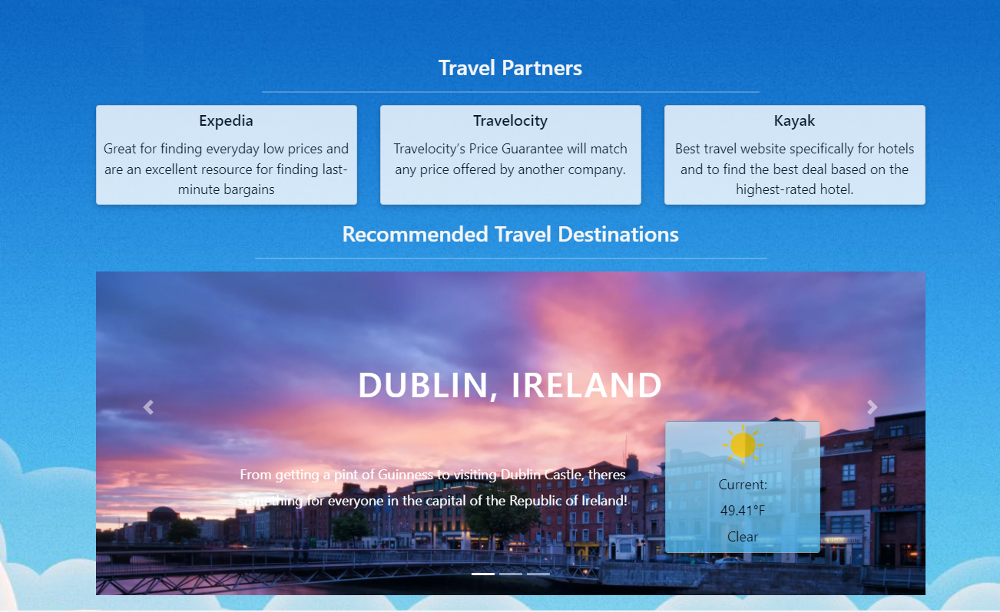

# SkyFall-Travel

## Description

This project allows a user to create, view, edit, and delete future travel plans. When visiting the site for the first time, a new user can sign up, creating  credentials that will be used to login going forward. Once logged in, users will have access to the dashboard, and from the dashboard, they can access all of our trip-related features. 

When creating a trip, users can specificy the dates of the trip and all stops contained within the trip plan. For each stop, the user can also add a budget plan that breaks down costs into four categories: Accomodation, Travel Costs, Food and Entertainment, and Other. Once the trip is created, the users can view the trip and see their cost breakdowns, as well some relevant weather data.

Now utilizing Docker

## Table of Contents 

[Installation](#Installation)
    
[Usage](#Usage)
    
[License](#License)
    
[Constributing](#Constributing)
    
[Tests](#Tests)
    
[Questions](#Questions)
    
    
## Installation (if Local Functionallity Desired)
    
1. Clone the repo from https://github.com/hcweigand10/SkyFall-Travel
2. Setup .env file with mysql login credentials
3. Open integrated terminal
4. Run "npm i" to install dependencies
5. Run schema file ("db/schema.sql") after connecting to mysql
6. Run "npm run seed" to seed the database
7. Run "npm start" to boot up the server
8. Connect to "http://localhost:3001" in your browser
    
    
## Usage
    
To use, visit https://vast-jade-swallow.cyclic.app/ 

Screenshots: 

GIF:

    
## License 
    
GitHub
    
    
## Contribution 
    
To contribute, contact us!
    
    
## Tests
    
Please report any bugs to us :) (We're sure you'll find some)
    
## Questions
    
For questions, email one of us at: 
- henryweigand10@gmail.com
- truont2@gmail.com
- mamarsolek@gmail.com
    
Or, checkout our githubs!
[hcweigand10](github.com/hcweigand10)
[truont2](github.com/hcweigand10)
[mmarsolek](github.com/hcweigand10)